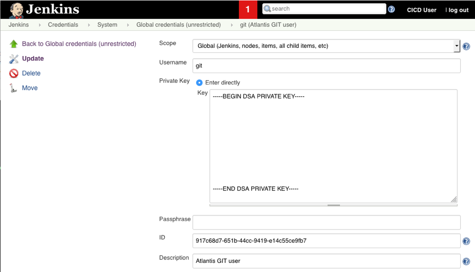

# Jenkins CICD pipeline

(Other) sources:
- [How I’ve created scaled and distributed Jenkins on top of Kubernetes?](https://medium.com/muhammet-arslan/how-ive-created-scaled-and-distributed-jenkins-top-of-kubernetes-441db62b15cd)


## Overview
Gives the base for building a pipeline with Jenkins.

## First install
The following manual configuration has to be performed to setup Jenkins after starting the container (`docker-compose up`) for the first time:
- URL: http://localhost:8082
- Enter secret (copy/paste from docker-compose output/log)
- Install recommended packages
- Create First Admin User: cicd (pw for atlantis in ewa)

## Configuration
Manage Jenkins – Configure System
- Pipeline Speed/Durability Settings: Performance optimized.
- Global properties (tick Environment variables):
   - ALT_DOCKER_REGISTRY = https://repository.mac-lean.com:10000
   - ALT_REPOSITORY = repository.mac-lean.com
Manage Jenkins – Manage Nodes
- Add label `docker` to the swarm-slave (done via docker-compose.yml already)

## GIT credentials
The easiest place to configure the GIT credentials is when creating the first Jenkins job:
- Multi-pipeline project
- Add Source: single repository and branch
   - Name: `master` (or desired branch)
   - Source Code Management: GIT
   - Repository URL: `ssh://git@git.mac-lean.com:1921/volume1/git/repo.git`
   - Credentials: Add -> See below for steps to add GIT user credentials
The credentials can be directly added to the Jenkins credentials store:
- Global credentials
- SSH Username with private key
- Tick: 'Enter directly' and add public key as clear text
- ID is set by Jenkins automatically (leave blank)


## Install plugins
Manage Jenkins – Install Plugins
- ThinBackup. Settings:
   - Backup directory: ${JENKINS_HOME}/backup
   - Backup schedule for full backups: 15 17 1 * * (every month 17:15)
   - Backup schedule for differential backups: NA
   - Max number of backup sets: 5
   - Select all after, however exclude 'backup additional files'
 - docker-plugin
 - amazon-ec2-plugin
 - audit-trail
 
## Rights on host system
Non-MAC only: run jenkinsRights.sh before `docker-compose up`

# Slaves
Slaves can be setup in various forms
- SSH (Master to Slave initiated)
- JNLP (Slave to Master initiated - Manually. Mind fixed port in Global Security)
- Swarm (Slave to Master initiated - Automatically). Autoscale manually
- Cloud (e.g. with EC2 plugin). All automatically

## AWS EC2 Cloud
With EC2 plugin the following needs to be performed:
- Terraform VPC setup (1 subnet would suffice)
- EC2 plugin installed
- Manage Jenkins - Configure Settings - Cloud (at the end) - Select Amazon EC2
Fill in the following information:
- EC2 Credentials
- Region
- EC2 Key pair
- AMI: ami-066ce9bb9f4cbb03d (ECS optimized, so has docker inside)
- Instance Type: t2.micro
- Avaialbility Zone
- Security Group (mind the AZ)
- Remote FS root: /home/ec2-user
- Remote user: ec2-user
- Labels (optional): aws-ec2
- Usage (optional): expression matching node
- Idle termination time: 10
- Advanced - Subnet IDs for VPC: Should be a public subnet
- Tags (optional)
- Instance Cap: 2
- Connection Strategy: Public IP

## Kubernetes Cloud
https://illya-chekrygin.com/2017/08/26/configuring-certificates-for-jenkins-kubernetes-plugin-0-12/
With Kubernetes plugin the following needs to be performed:
- Kubernetes cluster setup (Kind cluster will suffice)
- Kubernetes plugin installed
- Manage Jenkins - Configure Settings - Cloud (at the end) - Select Kubernetes
Fill in the following information (changes with every cluster create):
- Kubernetes URL (see script): Example: https://10.16.0.10:6443
- Kubernetes server certificate key (blank)
- Disable SSL check
- Kubernetes Namespace: jenkins
- Credentials (see script)
- Jenkins URL: http://10.0.2.2:8082 (this is the VirtualBox Service IP. From within POD: traceroute 8.8.8.8 from vagrant/kubernetes).

## OpenShift Cloud
The default Jenkins template might give permission errors when the default are used. The deployment yaml needs to be adapted using a custom image.
- Amend Dockerfile with proper tag to be pulled. E.g. quay.io/openshift/origin-jenkins:4.4.0
- Amend Dockerfile with fix
- Amend docker-compose.yml using the proper origin-jenkins to jenkins tag. e.g. registry.pro-eu-west-1.openshift.com/ci/jenkins:2.204.1
- push the image to the ImageStream
```
oc login console.pro-eu-west-1.openshift.com (coped from console login)
docker login -u "$(oc whoami -t)" -p "$(oc whoami -t)" registry.pro-eu-west-1.openshift.com
docker push registry.pro-eu-west-1.openshift.com/ci/jenkins:2.204.1
```
- Amend the OpenShift DeploymentConfig to use the new image
```
spec:
  template:
    spec:
      containers:
        - image: 'docker-registry.default.svc:5000/ci/jenkins:2.204.1'
  triggers:
    - type: ConfigChange
```
- Re-deploy

Removing tags
```
oc delete istag/jenkins:2.219
```
### Build agents
Normally build agents (by template) can only be build via BuildConfig template. To work around this one can build locally and directly push to the registry. The trick is to disable the openshift repositories so it will go to the public ones.
```
RUN yum-config-manager --disable \
    rhel-fast-datapath \
    rhel-fast-datapath-beta \
    rhel-server \
    rhel-server-extras \
    rhel-server-optional \
    rhel-server-ose \
    rhel-server-rhscl
```


# REST API
Take the following actions to setup REST API communication
- Add token to user under Users (just like e.g. AWS or GitHub). Example: ```11b3ae17a2274fe565e92ad3370c44aaca```
- Get crumb (Mind the "prompt", this should be excluded!!)
```
curl --user "cicd:11b3ae17a2274fe565e92ad3370c44aaca" 'http://localhost:8082/crumbIssuer/api/xml?xpath=concat(//crumbRequestField,":",//crumb)'

64dedad54579fbbf497359d57307a59d
```
- Copy crumb and use it in the API call
```
curl -X POST http://localhost:8082/job/hello-world/build --user cicd:11b3ae17a2274fe565e92ad3370c44aaca --data-urlencode json='' -H "Jenkins-Crumb:64dedad54579fbbf497359d57307a59d"
```
- Get information with
```
curl -s --user cicd:11b3ae17a2274fe565e92ad3370c44aaca http://localhost:8082/job/hello-world/lastBuild/api/json | jq
```

# Jenkins CLI
The Jenkins CLI can be used to fully control Jenkins. More information at https://jenkins.io/doc/book/managing/cli/. In short:
- Add token to user under Users (just like e.g. AWS or GitHub). Example: ```11b3ae17a2274fe565e92ad3370c44aaca```
- Download jenkins-cli.jar with http://localhost:8082/jnlpJars/jenkins-cli.jar
- Execute with (example). Restart is needed to keep config in sync.
```
java -jar jenkins-cli.jar -s http://localhost:8082 -auth cicd:11b3ae17a2274fe565e92ad3370c44aaca install-plugin aws-lambda -restart
```

# Audit Trail
Extensive auditing after installing this plugin. To configure follow the following steps in Manage Jenkins - Configure System:
- Loggers to Log file
- Log Location: /var/jenkins_home/audit.log

# Mail Notification
The mail client in Jenkins it fairly old and has a hard time dealing with TLS. Hence GMX is not working and has to be tested with google. Additionally it seems that the Extended Mail Client is preferred over the native Mailer. Even till that extend that the former settings overwrite the latter setting. Take the following steps to get gmail working:
- Google: Configure the gmail account with "Less secure app access = ON"
- Jenkins (Both Mailer and emailExt):
- SMTP Server – smtp.gmail.com
- Click Advance
- Check – Use SMTP Authentication
- Provide User Name
- Provide Password
- Check – Use SSL
- SMTP port 465
Example mail call in post part:
```
emailext (
   subject: "STARTED: Job '${env.JOB_NAME} [${env.BUILD_NUMBER}]'",
   body: """<p>STARTED: Job '${env.JOB_NAME} [${env.BUILD_NUMBER}]':</p>
   <p>Check console output at &QUOT;<a href='${env.BUILD_URL}'>${env.JOB_NAME} [${env.BUILD_NUMBER}]</a>&QUOT;</p>""",
   to: "nms.maclean@gmx.com"
)
```

# Slack Notification
Generate token in Slack:
- Go to channel in Slack
- Add app
- Add Jenkins CI
- Get token
Configure Jenkins:
- Add credentials: add secret
- The secret is the token generated above

# Migration
Jenkins hardly runs on the NAS (and has been disconintued on the NAS). Hence, the jenkins environment must be portable (e.g. copied to the laptop) to take over processing. The following steps need to be performed to setup/clone the jenkins environment
## Option 1
On source system:
- create backup with ThinBackup (Manage Jenkins - ThinBackup)
- copy last FULL-xxx  from jenkins/backup (BACKUPSET_*.zip holds previous backups)
On destination system:
- git clone
- `docker-compose up` and go trough initial setup. Only install ThinBackup plugin and configure as mentioned above.
- Create jenkins/backup and store the backup here
- Restore from backup, incl next build and plugins
- System restarts (when stuck: restart docker-compose when no messages are given anymore)
- Restore:
   - Manage Jenkins – Configure System: Jenkins URL to the appropriate location
   - Credentials (Users). Key and passphrase only.
   - Per project: Scan Multi-branch Pipeline Now
   - Continue as usual
## Option 2
Just take a full backup of the repo directory can copy across.

## Troubleshooting
| Description | Solution |
|---|---|---|---|---|
| No permission to /var/run/docker.sock | run jenkinsRights.sh before `docker-compose up` |
| Access to root | `docker exec -ti -u root jenkins bash` |
|   |   |
